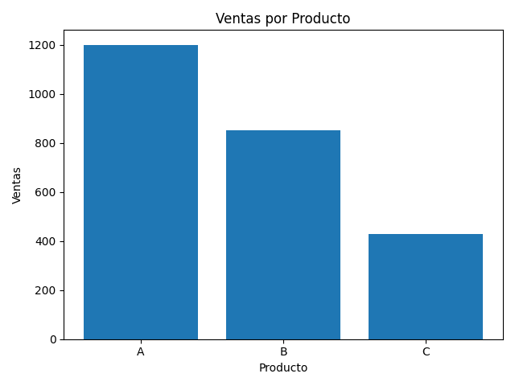

---
title: "Reporte Automatizado de Ventas"
author: "Departamento de Analytics"
date: "2026-02-13"
---

# 📊 Reporte Ejecutivo

## 🧾 Resumen General

- Total Ventas: **$2480**
- Promedio por Producto: **$826.67**
- Mejor Producto: **A**
- Peor Producto: **C**

---

## 📋 Tabla de Datos

| Producto   |   Ventas | Region   |
|:-----------|---------:|:---------|
| A          |     1200 | Norte    |
| B          |      850 | Sur      |
| C          |      430 | Este     |

---

## 📈 Gráfico de Ventas

---

## 📝 Conclusiones

> El producto A lidera las ventas.
>
> Se recomienda revisar la estrategia del producto C.

---

<footer>
Reporte generado automáticamente.
</footer>
